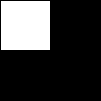
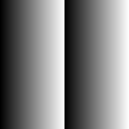
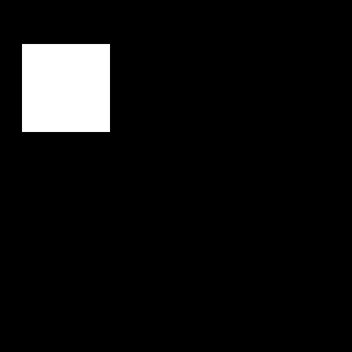
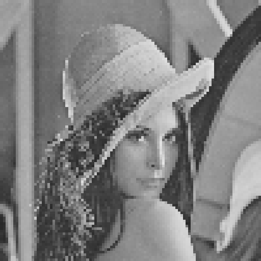

# Laboratorium pierwsze

> Podczas pierwszego laboratorium zajmą się Państwo generowaniem prostych obrazów monochromatycznych. Rozpoczniemy od reprezentacji i zapisu obrazów, kończąc na próbie samodzielnej implementacji ich skalowania z wykorzystaniem dwóch metod interpolacji.

#### Reprezentacja

Formatem, w którym będziemy zapisywać pliki graficzne w tym laboratorium będą **monochromatyczne** pliki **PNG** o głębi **ośmiu bitów**, zgodne ze standardem [RFC 2083](https://tools.ietf.org/html/rfc2083).

W pamięci programów będziemy reprezentować je jako dwuwymiarowe tablice [`numpy`](http://www.numpy.org), ze względu na wybraną głębie, wykorzystujące typ ośmiobitowej liczby całkowitej bez znaku ([`uint8`](https://docs.scipy.org/doc/numpy-1.13.0/user/basics.types.html)), a więc przyjmujące wartości z zakresu `0—255`.

Uruchommy więc interpreter Pythona i zaimportujmy w nim bibliotekę `numpy`.

```python
> python
Python 3.7.0 (default, Oct 13 2018, 22:13:00)
>>> import numpy as np
```

Rozdzielczość obrazu (wielkość macierzy) przekazujemy za pomocą krotki, której wartości decydują o liczbie wierszy i kolumn obrazu. Zadeklarujmy więc zmienną `size`, która pozwoli nam na inicjalizację czarnego obrazu o wymiarach 4 na 4 piksele

```python
>>> size = (4, 4)
```

Przy użyciu numpy generujemy dwuwymiarową macierz o zadanej wielkości, wypełnioną zerami, reprezentowanymi typem `uint8`.

```python
>>> image = np.zeros(size).astype(np.uint8)
>>> image
array([[0, 0, 0, 0],
       [0, 0, 0, 0],
       [0, 0, 0, 0],
       [0, 0, 0, 0]], dtype=uint8)
```

Adresowanie w `numpy` zbliżone jest do tego, który znają Państwo doskonale z darzonego [powszechnym uwielbieniem Matlaba](http://www.quickmeme.com/img/30/305cb52ae2d2ff1b40eafe0dc771811b5e4a4edab38d0a5fc0ca171662075018.jpg). Poszczególne komórki wybieramy przez podanie po przecinkach ich kolejności w każdym z wymiarów. Ustalmy więc wartość czwartej komórki w trzecim rzędzie na `128`.

```python
>>> image[2, 3] = 128
>>> image
array([[  0,   0,   0,   0],
       [  0,   0,   0,   0],
       [  0,   0,   0, 128],
       [  0,   0,   0,   0]], dtype=uint8)
```

Podobnie ma się sprawa z zakresami. W polu wybranego wymiaru dwukropkiem oddzielamy jego początek (przedział zamknięty) i koniec (przedział otwarty). Spróbujmy więc ustalić wartość pikseli w kwadracie zamkniętym przez kolumny od pierwszego do trzeciego i rzędy od drugiego do czwartego na `64`.

```python
>>> image[1:3, 0:2] = 64
>>> image
array([[  0,   0,   0,   0],
       [ 64,  64,   0,   0],
       [ 64,  64,   0, 128],
       [  0,   0,   0,   0]], dtype=uint8)
```

Przy użyciu operacji logicznych możemy łatwo wyliczać binarne maski naszch obrazów. Przykładowo, spójrzmy na maskę obrazu wskazującą piksele o wartości większej niż 32.

```python
image > 32
array([[False, False, False, False],
       [ True,  True, False, False],
       [ True,  True, False,  True],
       [False, False, False, False]])
```

Masek binarnych możemy używać też do wybiórczego adresowania obrazu. Ustalmy więc wartość wszystkich pikseli o wartości większej niż `32`
 na dokładnie `32`.

```python
>>> image[image > 32] = 32
>>> image
array([[ 0,  0,  0,  0],
       [32, 32,  0,  0],
       [32, 32,  0, 32],
       [ 0,  0,  0,  0]], dtype=uint8)
```

W wypadku przekroczenia zakresu (wartości piksela spoza przedziału `0—255`), wprowadzimy do obrazu wynik dzielenia modulo przez jego maksymalną wartość.

```python
>>> image[0, 0] = 300
>>> image
array([[44,  0,  0,  0],
       [32, 32,  0,  0],
       [32, 32,  0, 32],
       [ 0,  0,  0,  0]], dtype=uint8)
```

Umieją Państwo już generować obrazy i adresować w ich obrębie. Przejdźmy więc do ich zapisu i nareszcie zobaczmy je na ekranie komputera w innej reprezentacji niż macierz.

#### Zapis

Aby zapisać obraz musimy posiadać obraz (sic!). Wygenerujmy więc czarny kwadrat o bokach `128` na `128` pikseli, którego lewą górną ćwiartkę, poza jednym pikselem obramowania, wypełnimy bielą.

```python
>>> image = np.zeros((128, 128)).astype(np.uint8)
>>> image[1:64,1:64] = 255
>>> image
array([[  0,   0,   0, ...,   0,   0,   0],
       [  0, 255, 255, ...,   0,   0,   0],
       [  0, 255, 255, ...,   0,   0,   0],
       ...,
       [  0,   0,   0, ...,   0,   0,   0],
       [  0,   0,   0, ...,   0,   0,   0],
       [  0,   0,   0, ...,   0,   0,   0]], dtype=uint8)
```

Do repozytorium z instrukcją dołączony został moduł `obpng`. Upewniwszy się, że znajduje się w katalogu roboczym, zaimportujmy z niego metodę `write_png()`.

```
from obpng import write_png
```

Przyjmuje ona dwa argumenty. Pierwszym musi być macierz `numpy` z wartościami typu `uint8`, a drugim nazwa pliku. Zapiszmy więc nasz kwadrat do pliku `foo.png`.

```
write_png(image, 'foo.png')
```

Jeśli wszystko poszło zgodnie z planem, w katalogu roboczym powinien znaleźć się plik graficzny wyglądający jak poniżej.



Testowo wygenerujmy sobie jeszcze obraz z gradientem. Posługując się pętlą for iterującą po wszystkich kolumnach obrazu, przypiszmy do nich dwukrotność ich indeksu.

```
>>> image = np.zeros((256,256)).astype(np.uint8)
>>> for i in range(256):
...     image[:, i] = i * 2
...
>>> write_png(image, 'bar.png')
```



Gratulacje. Potrafimy już generować obrazy i zapisywać je w formacie PNG.

## Lista zadań

1. Zadania realizują Państwo przez implementację modułu `solution.py`, który na tę chwilę zawiera jedynie puste funkcje z ich interfejsami.
2. Przy realizacji zadań wolno Państwu zaimportować **jedynie moduły `numpy` i `obpng`**.
2. Deklaracją rozwiązania każdego z zadań jest odkomentowanie jego sekcji w skrypcie `check.py`.
3. Po wykonaniu każdego z zadań należy w katalogu roboczym instrukcji wywołać komendę `make`, która uruchomi skrypt `check.py`, zapisując do katalogu `results` wyniki działania funkcji z modułu `solution.py`.
4. Po zrealizowaniu zadań należy zacommitować zmiany i wypchnąć je na repozytorium, a następnie zgłosić to prowadzącemu do oceny.
5. Podstawą oceny jest zawartość pliku `solution.py` oraz katalogu `results`.

## Zadania na ocenę dostateczną
### Kwadrat

Jako zadanie rozgrzewkowe należy zaimplementować funkcję `square()`. Przyjmuje ona trzy argumenty:

- `size` — liczba wierszy i kolumn obrazu
- `side` — długość boku kwadratu
- `start` — lokalizacja lewego górnego boku kwadratu

Funkcja ma generować czarny obraz o wymiarach zadanych w `side`, wewnątrz którego znajdzie się biały kwadrat o boku `side`, którego lewy górny róg znajdzie się w lokalizacji `start`. Poniżej przykładowe wywołanie i rezultat.

```python
image = square(512, 128, (32, 64))
write_png(image, 'results/1_square.png')
```



### Kółeczko

Po zaliczeniu całej góry kursów matematycznych na Politechnice, znają Państwo z pewnością [wzór na koło](https://pl.wikipedia.org/wiki/Koło). W ramach zadania należy zaimplementować funkcję `midcircle()`, która będzie zwracać obraz o zadanych wymiarach (to jej jedyny argument), na którego środku znajdować się będzie białe koło na czarnym tle. Promień koła ma wynosić ćwierć krótszego z wymiarów.

Poniżej przykładowe wywołania i rezultaty.
```python
image = midcircle((256, 512))
write_png(image, 'results/2_circle_2.png')
```


```python
image = midcircle((512, 256))
write_png(image, 'results/2_circle_1.png')
```


> Postaraj się nie marnować mocy obliczeniowej i nie wyliczaj tego samego kwadratu promienia na potrzeby wszystkich iteracji pętli.

<!-- **Wyzwanie.** A weź spróbuj walnąć tu gradient uzależniony od odległości od środka koła. Nie dostaniesz za to żadnych dodatkowych punktów. -->

### Szachownica

Ostatnim elementem zadania na ocenę dostateczną jest implementacja funkcji `checkerboard()`, za argument przyjmującej liczbę wierszy i kolumn kwadratowej szachownicy. Funkcja ma, a jakże, generować szachownicę, jak na poniższym przykładzie.

```python
image = checkerboard(256)
write_png(image, 'results/3_checkerboard.png')
```


> **Protip.** Dzielenie bez reszty (`//`), operacje modulo (`%`) i xor (`!=`) są czasem bardzo przydatne. Nie zaszkodzi również wyliczyć sobie jakiś współczynnik do dzielenia bez reszty (może wystarczy podzielić wymiar obrazu przez liczbę rzędów w szachownicy?).

#### Odczyt obrazów.

W zadaniach na ocenę dobrą i bardzo dobrą nie będziemy już generować obrazów, a posłużymy się popularnym obrazem benchmarkowym. Na potrzeby laboratorium zawsze będą one znajdować się w katalogu `data`.

W module `obpng` została zaimplementowana funkcja `read_png()`, która za argument przyjmuje ścieżkę do pliku graficznego. Zaimportujmy ją zatem.

```
>>> from obpng import read_png
```

Wczytajmy przy jej pomocy obraz, będący zdjęciem Leny Söderberg.

```
>>> lenna = read_png('data/mono/lenna.png')
```

**Tu proszę zwrócić uwagę na strukturę wczytanego obrazu. Odczytajmy z macierzy atrybut `shape`.**

```python
>>> lenna.shape
(512, 512, 1)
```

**Jak widać, wczytany obraz nie jest dwu, a trójwymiarowy, nawet jeśli w trzecim wymiarze posiadamy tylko jedną warstwę (nazywaną kanałem). Aby ułatwić sobie przetwarzanie, pozbądźmy się jej ze struktury, za pomocą funkcji [`squeeze()`](https://docs.scipy.org/doc/numpy-1.15.1/reference/generated/numpy.squeeze.html) z modułu `numpy`**

```python
>>> lenna = np.squeeze(lenna)
>>> lenna.shape
(512, 512)
```

Wczytany obraz prezentuje się tak jak poniżej.

```
>>> lenna
array([[162, 162, 164, ..., 166, 153, 129],
       [162, 162, 164, ..., 166, 153, 129],
       [162, 162, 164, ..., 166, 153, 129],
       ...,
       [ 54,  54,  59, ..., 110, 105, 106],
       [ 53,  53,  63, ..., 109, 111, 113],
       [ 53,  53,  63, ..., 109, 111, 113]], dtype=uint8)
```


#### Interpolacja

Zadania na oceny wyższe niż dostateczna będą polegać na samodzielnej implementacji funkcji realizujących skalowanie (zmianę wymiarów) obrazu z wykorzystaniem dwóch podstawowych metod [interpolacji](https://pl.wikipedia.org/wiki/Interpolacja_(grafika_komputerowa)).

Na interpolację możemy patrzeć na podstawowe narzędzie przydatne w takich zadaniach jak przybliżanie, obracanie obrazów, czy jego korekcje geometryczne. W tym zadaniu wykorzystamy ją do *resamplingu* obrazu. Co do zasady interpolacja jest procesem wykorzystywanym do estymowania wartości w nieznanych obszarach obrazu.

## Zadanie na ocenę dobrą

### Interpolacja najbliższego sąsiada

Najprostszą metodą interpolacji jest metoda *najbliższego sąsiada*. Nie wymaga ona przesadnie dużej mocy obliczeniowej i jest dosyć prosta w implementacji. Daje marne i pełne zniekształceń rezultaty, będąc raczej rzadko stosowaną w praktyce, ale od czegoś trzeba w końcu zacząć.

Zadaniem jest implementacja funkcji `nn_interpolation`, która przyjmuje obraz wejściowy (`source`) i docelowe wymiary obrazu wyjściowego (`new_size`). Implementacja powinna polegać na wygenerowaniu nowego obrazu, w którym do każdego piksela wprost przypisana zostanie wartość tego punktu z obrazu wejściwego, którego lokalizację uda się wyliczyć na podstawie proporcji pomiędzy wymiarami źródła i celu.

Poniżej przykładowe wywołanie po przeskalowaniu obrazu w dół do rozdzielczości `100` na `100` i ponownym przeskalowaniu w góry do rozdzielczości oryginalnej.

```
image = nn_interpolation(lenna, (100, 100))
image = nn_interpolation(image, (512, 512))
write_png(image, 'results/4_nn.png')
```



> Na ocenę 4.5 postaraj się skorygować interpolację tak, aby wyznaczać faktycznego najbliższego sąsiada nowego piksela w źrodłowym obrazie, a nie jedynie jego zaokrąglenie w dół.<br>

## Zadanie na ocenę bardzo dobrą

### Interpolacja dwuliniowa.

Na ocenę bardzo dobrą należy zmierzyć się już z odrobinę trudniejszym wyzwaniem, w postaci implementacji [interpolacji dwuliniowej](https://pl.wikipedia.org/wiki/Interpolacja_dwuliniowa).

Zadaniem jest implementacja funkcji `bilinear_interpolation`, która przyjmuje obraz wejściowy (`source`) i docelowe wymiary obrazu wyjściowego (`new_size`). Implementacja powinna polegać na wygenerowaniu nowego obrazu, w którym dla każdego piksela wyliczamy wartość na podstawie czterech najbliższych sąsiadów z obrazu wejściowego.

Poniżej przykładowe wywołanie po przeskalowaniu obrazu w dół do rozdzielczości `100` na `100` i ponownym przeskalowaniu w góry do rozdzielczości oryginalnej za pomocą interpolacji najbliższych sąsiadów.

```
image = bilinear_interpolation(lenna, (100, 100))
image = nn_interpolation(image, (512, 512))
write_png(image, 'results/5_bilinear.png')
```


Pomocnym w realizacji może okazać się poniższy wzór i ilustracja:


